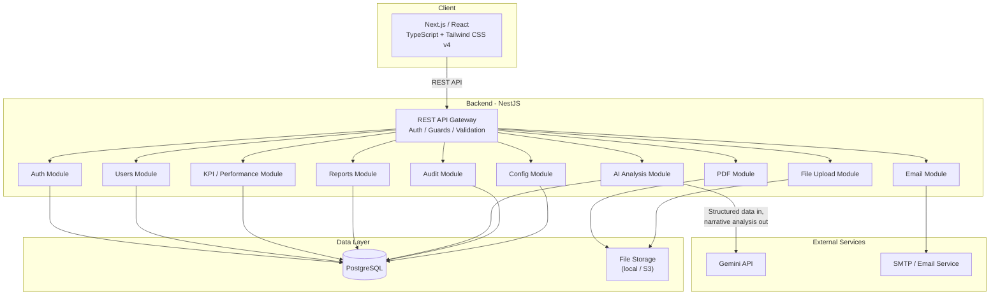
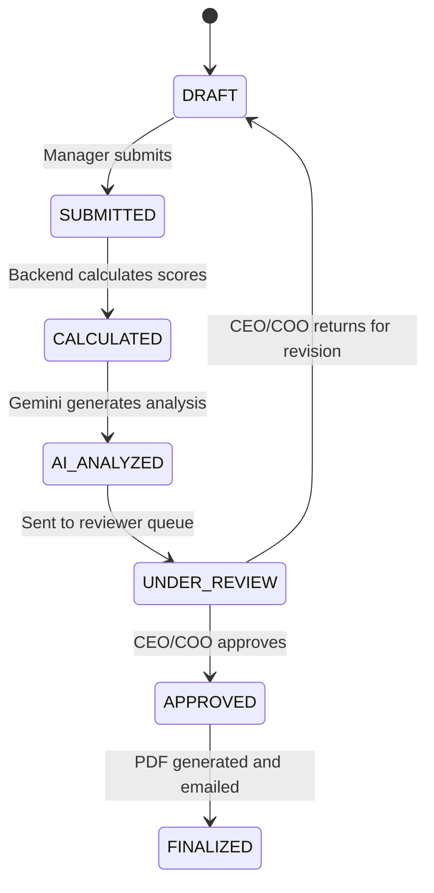
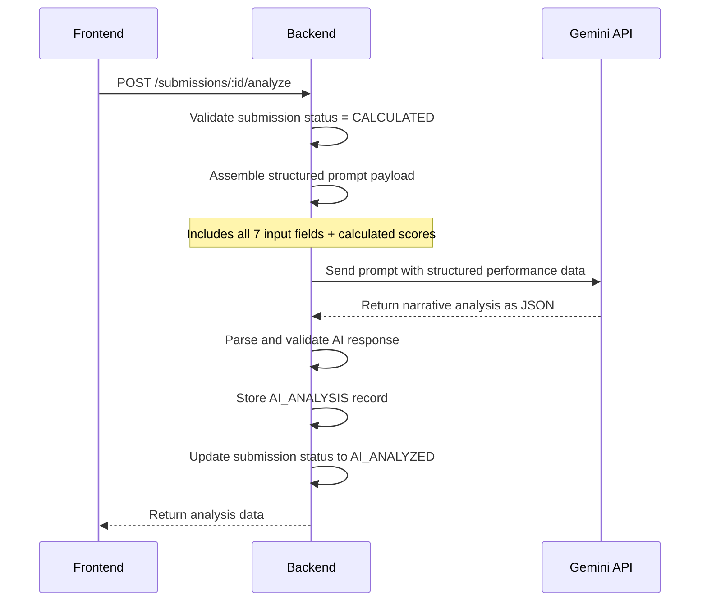
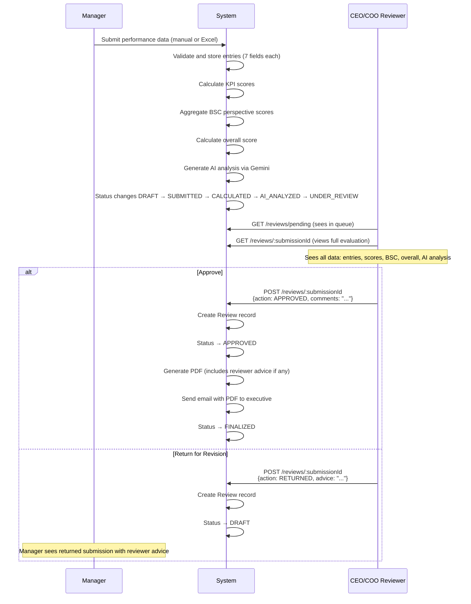

# Performance Reporting System — Implementation Plan (v2)

## Overview

A centralized web application that replaces manual executive performance reporting with an automated system built on the Balanced Scorecard (BSC) framework.

**INPUT**: Managers submit performance data via Excel upload (confirmed 7-column template) or manual entry through the system.

**PROCESSING**: The backend validates data, calculates KPI achievement and scores, aggregates BSC perspective scores, computes overall performance, and generates AI-assisted narrative analysis via Gemini. A CEO/COO then reviews and approves the evaluation.

**OUTPUT**: A professional Executive Performance Report (PDF), emailed to the relevant executive.

---

## Changes from v1

> [!IMPORTANT]
> This is a **revised plan** incorporating the client-provided Excel input template. Key changes:
> 1. **Excel structure confirmed**: Perspective, Objective, Measurement, Unit, Plan, Actual, Notes
> 2. **New fields added throughout**: `measurement`, `unit`, `notes` — added to database, parser, manual entry form, AI payload, PDF
> 3. **Scoring/weighting/rating rules**: Reframed as **unconfirmed business rules** with temporary defaults — not assumptions or design decisions
> 4. **Excel upload promoted** to Phase 2 (alongside manual entry) since both are primary input methods
> 5. **Clear INPUT → PROCESSING → OUTPUT separation** added

---

## User Review Required

> [!IMPORTANT]
> **Git Repository Issue**: There is a nested `backend/backend/` directory with its own `.git` folder, which is blocking `git add`. Before we begin implementation, we need to:
> 1. Delete the nested `backend/backend/` directory
> 2. Initialize NestJS cleanly inside `backend/`
>
> I will handle this in Phase 0.

> [!IMPORTANT]
> **Tailwind CSS Version**: The frontend is already scaffolded with Tailwind CSS v4 (using `@tailwindcss/postcss`). The plan will use Tailwind v4 conventions (CSS-based configuration, `@theme` directives instead of `tailwind.config.js`).

---

## Open Questions

> [!CAUTION]
> **Q1 — Scoring & Weighting Rules — UNCONFIRMED BUSINESS RULE**
>
> The sample final report shows that achievement can exceed 100% while the score may be capped at 100%.
>
> However, the following have **NOT been confirmed by the client**:
> - Is the score cap always 100%? Can it vary by KPI or perspective?
> - Are BSC perspective weights equal (25% each) or different?
> - Are individual KPI weights equal within a perspective, or do some KPIs carry more importance?
> - What is the exact formula for calculating the overall score from perspective scores?
>
> **MVP approach**: Use temporary defaults (equal weights, score cap at 100%, simple average). All scoring rules are stored in a configurable `scoring_config` table and read at calculation time — never hard-coded in the calculation logic. The defaults can be changed via the admin settings page or directly in the database without code changes.
>
> **These defaults must be confirmed or replaced by the client before production use.**

> [!CAUTION]
> **Q2 — Rating Thresholds — UNCONFIRMED BUSINESS RULE**
>
> The sample report contains ratings "Excellent" and "Good" but the exact thresholds have **NOT been confirmed**.
>
> **MVP approach**: Use temporary defaults stored in a configurable `rating_thresholds` table:
> - Excellent: 90–100
> - Good: 75–89.99
> - Satisfactory: 60–74.99
> - Needs Improvement: 0–59.99
>
> **These are placeholder values only. They must be confirmed by the client.**

> [!CAUTION]
> **Q5 — KPI Direction (Higher vs Lower is Better) — UNCONFIRMED BUSINESS RULE**
>
> The client Excel contains KPIs where the intended scoring direction is ambiguous:
> - "Control operating cost": Plan 5, Actual 4.2 — lower actual may mean better?
> - "Reduce operational errors": Plan 2, Actual 2.8 — lower actual may mean better?
> - "Training hours per employee": Plan 20, Actual 22 — higher actual may mean better?
>
> Because the client has **not confirmed the scoring direction**, the MVP will:
> - Use a single formula: `Achievement = Actual / Plan × 100` for all KPIs
> - Include a `direction` column in `KPI_DEFINITION` (enum: `HIGHER_IS_BETTER | LOWER_IS_BETTER`, default: `HIGHER_IS_BETTER`) — present in the schema but **not applied in the MVP calculation**
> - The direction logic will be activated once the client confirms the rules
>
> **Do NOT infer the intended direction from sample data.**

> [!NOTE]
> **Q3 — Excel Input Format — RESOLVED**
>
> The client provided a sample Excel with the following structure:
>
> | Perspective | Objective | Measurement | Unit | Plan | Actual | Notes |
> |---|---|---|---|---|---|---|
> | Financial | Control operating cost | % budget variance | % | 5 | 4.2 | optional |
>
> The MVP parser will be built around this 7-column structure. The file-processing architecture remains modular (Strategy pattern) so the parser can be replaced if the template changes.

> [!NOTE]
> **Q4 — Email Provider**: Use Nodemailer with SMTP configuration via environment variables. Replaceable later.

> [!NOTE]
> **Q6 — Organization**: Single organization for MVP. No multi-tenancy.

---

## Input → Processing → Output

This section explicitly maps the data flow through the system.

### INPUT (what goes into the system)

Source: Excel upload **or** manual entry via web form

| Field | Source | Required |
|---|---|---|
| Perspective | Excel column / form select | Yes |
| Objective | Excel column / form input | Yes |
| Measurement | Excel column / form input | Yes |
| Unit | Excel column / form input | Yes |
| Plan | Excel column / form input | Yes |
| Actual | Excel column / form input | Yes |
| Notes | Excel column / form input | No |

Additional context (not from Excel, entered in the system):
- Executive / person name (from user profile or selected by submitter)
- Reporting period type (Weekly / Monthly / Quarterly / Yearly)
- Reporting period dates

### PROCESSING (what the system calculates)

All calculations are **deterministic backend logic** — not AI:

```
Step 1: Per-KPI Calculation
  achievement_pct = (actual / plan) × 100
  score = min(achievement_pct, scoring_config.score_cap)
  rating = lookup from rating_thresholds table

Step 2: BSC Perspective Aggregation
  For each of the 4 perspectives:
    perspective_score = weighted_average(kpi_scores, kpi_weights)
    perspective_rating = lookup from rating_thresholds table

Step 3: Overall Score
  overall_score = weighted_average(perspective_scores, perspective_weights)
  overall_rating = lookup from rating_thresholds table
```

AI generates (via Gemini, from pre-calculated structured data):
- Executive summary
- Strengths
- Improvement areas
- Recommendations

### OUTPUT (the final Executive Performance Report)

The report contains:

| Section | Source |
|---|---|
| Executive name | User profile |
| Reporting period | Submission metadata |
| Overall score | Calculated (Step 3) |
| Overall rating | Calculated (Step 3) |
| Executive summary | AI-generated |
| Strengths | AI-generated |
| Improvement areas | AI-generated |
| BSC perspective scores (4) | Calculated (Step 2) |
| KPI detail table | Input + Calculated (Step 1) |
| CEO/COO advice/comments | Reviewer input (if applicable) |

KPI detail table columns:

| Perspective | Objective | Plan | Actual | Achievement % | Score | Rating |
|---|---|---|---|---|---|---|

---

## 1. Overall Architecture



### Key Architectural Principles

1. **Backend owns all business logic** — calculations, scoring, validation, workflow state
2. **Frontend is presentation only** — rendering, user interaction, form handling
3. **AI supplements, never replaces deterministic logic** — math in backend, narrative from Gemini
4. **Configuration over hard-coding** — scoring rules, weights, thresholds stored in database, read at calculation time, editable by admin
5. **Pluggable file processing** — abstract parser interface with Strategy pattern; current parser targets the confirmed Excel template
6. **No invented business rules** — where the client has not confirmed a rule, the system uses a temporary configurable default and marks it clearly

---

## 2. Project / Folder Structure

```
performance-reporting-system/
├── docker-compose.yml
├── README.md
├── .env.example
│
├── frontend/                          # Next.js 16 (App Router)
│   ├── app/
│   │   ├── (auth)/                    # Auth route group (no layout chrome)
│   │   │   ├── login/page.tsx
│   │   │   └── layout.tsx
│   │   ├── (dashboard)/               # Authenticated route group
│   │   │   ├── layout.tsx             # Sidebar + header layout
│   │   │   ├── page.tsx               # Dashboard home
│   │   │   ├── performance/
│   │   │   │   ├── page.tsx           # Performance submission list
│   │   │   │   ├── new/page.tsx       # New submission (manual entry)
│   │   │   │   ├── upload/page.tsx    # Excel upload
│   │   │   │   └── [id]/page.tsx      # Submission detail view
│   │   │   ├── reports/
│   │   │   │   ├── page.tsx           # Reports list
│   │   │   │   └── [id]/page.tsx      # Report detail + review
│   │   │   ├── review/                # CEO/COO review queue
│   │   │   │   ├── page.tsx           # Pending reviews list
│   │   │   │   └── [id]/page.tsx      # Review + approve
│   │   │   ├── users/                 # Admin: user management
│   │   │   │   └── page.tsx
│   │   │   └── settings/              # Admin: system config
│   │   │       └── page.tsx
│   │   ├── globals.css
│   │   └── layout.tsx                 # Root layout
│   ├── components/
│   │   ├── ui/                        # Reusable primitives (Button, Input, Modal, Table, etc.)
│   │   ├── layout/                    # Sidebar, Header, Footer
│   │   ├── charts/                    # Chart components (BSC radar, bar, trend)
│   │   ├── forms/                     # KPI entry form, upload form
│   │   └── reports/                   # Report preview, KPI table, PDF viewer
│   ├── lib/
│   │   ├── api.ts                     # Axios/fetch wrapper for backend API
│   │   ├── auth.ts                    # Auth utilities, token management
│   │   └── types.ts                   # Shared TypeScript interfaces
│   ├── hooks/                         # Custom React hooks
│   ├── public/
│   ├── package.json
│   ├── tsconfig.json
│   └── next.config.ts
│
├── backend/                           # NestJS
│   ├── src/
│   │   ├── main.ts
│   │   ├── app.module.ts
│   │   ├── common/
│   │   │   ├── decorators/            # @Roles(), @CurrentUser()
│   │   │   ├── guards/                # JwtAuthGuard, RolesGuard
│   │   │   ├── interceptors/          # AuditInterceptor, TransformInterceptor
│   │   │   ├── filters/               # HttpExceptionFilter
│   │   │   ├── pipes/                 # ValidationPipe config
│   │   │   └── constants/             # Enums, role constants
│   │   ├── config/                    # ConfigModule, env validation
│   │   ├── auth/
│   │   │   ├── auth.module.ts
│   │   │   ├── auth.controller.ts
│   │   │   ├── auth.service.ts
│   │   │   ├── strategies/            # JwtStrategy, LocalStrategy
│   │   │   └── dto/
│   │   ├── users/
│   │   │   ├── users.module.ts
│   │   │   ├── users.controller.ts
│   │   │   ├── users.service.ts
│   │   │   ├── entities/user.entity.ts
│   │   │   └── dto/
│   │   ├── kpi/                       # KPI definitions & scoring configuration
│   │   │   ├── kpi.module.ts
│   │   │   ├── kpi.controller.ts
│   │   │   ├── kpi.service.ts
│   │   │   ├── entities/
│   │   │   │   ├── kpi-definition.entity.ts
│   │   │   │   ├── scoring-config.entity.ts
│   │   │   │   └── rating-threshold.entity.ts
│   │   │   └── dto/
│   │   ├── performance/               # Performance submissions & calculations
│   │   │   ├── performance.module.ts
│   │   │   ├── performance.controller.ts
│   │   │   ├── performance.service.ts
│   │   │   ├── calculation.service.ts  # Achievement, score, aggregation logic
│   │   │   ├── entities/
│   │   │   │   ├── performance-submission.entity.ts
│   │   │   │   ├── performance-entry.entity.ts
│   │   │   │   └── bsc-perspective-score.entity.ts
│   │   │   └── dto/
│   │   ├── reports/                   # Report lifecycle & review workflow
│   │   │   ├── reports.module.ts
│   │   │   ├── reports.controller.ts
│   │   │   ├── reports.service.ts
│   │   │   ├── entities/
│   │   │   │   ├── report.entity.ts
│   │   │   │   └── review.entity.ts
│   │   │   └── dto/
│   │   ├── ai/                        # Gemini integration
│   │   │   ├── ai.module.ts
│   │   │   ├── ai.service.ts
│   │   │   ├── entities/
│   │   │   │   └── ai-analysis.entity.ts
│   │   │   └── prompts/               # Prompt templates
│   │   ├── file-upload/               # Excel/document processing
│   │   │   ├── file-upload.module.ts
│   │   │   ├── file-upload.controller.ts
│   │   │   ├── file-upload.service.ts
│   │   │   ├── parsers/               # Pluggable parser strategies
│   │   │   │   ├── parser.interface.ts
│   │   │   │   └── client-template.parser.ts
│   │   │   ├── entities/
│   │   │   │   └── uploaded-file.entity.ts
│   │   │   └── dto/
│   │   ├── pdf/                       # PDF generation
│   │   │   ├── pdf.module.ts
│   │   │   ├── pdf.service.ts
│   │   │   └── templates/             # HTML/CSS report templates
│   │   ├── email/                     # Email sending
│   │   │   ├── email.module.ts
│   │   │   ├── email.service.ts
│   │   │   └── templates/             # Email HTML templates (Handlebars)
│   │   └── audit/                     # Audit logging
│   │       ├── audit.module.ts
│   │       ├── audit.service.ts
│   │       ├── audit.interceptor.ts
│   │       └── entities/audit-log.entity.ts
│   ├── test/
│   ├── package.json
│   ├── tsconfig.json
│   ├── nest-cli.json
│   └── .env.example
```

---

## 3. Database Entities and Relationships

```mermaid
erDiagram
    USER {
        uuid id PK
        varchar email UK
        varchar password_hash
        varchar first_name
        varchar last_name
        enum role "ADMIN | MANAGER | REVIEWER"
        varchar department
        boolean is_active
        timestamp created_at
        timestamp updated_at
    }

    KPI_DEFINITION {
        uuid id PK
        enum perspective "FINANCIAL | CUSTOMER | INTERNAL_PROCESS | LEARNING_GROWTH"
        varchar objective
        varchar measurement
        varchar unit
        varchar description
        enum direction "HIGHER_IS_BETTER | LOWER_IS_BETTER"
        decimal weight "default 1.0"
        boolean is_active
        int sort_order
        timestamp created_at
        timestamp updated_at
    }

    SCORING_CONFIG {
        uuid id PK
        varchar config_key UK
        jsonb config_value
        varchar description
        boolean is_confirmed "false until client confirms"
        timestamp updated_at
    }

    RATING_THRESHOLD {
        uuid id PK
        varchar label "Excellent, Good, Satisfactory, etc."
        decimal min_score
        decimal max_score
        int sort_order
        boolean is_confirmed "false until client confirms"
    }

    PERFORMANCE_SUBMISSION {
        uuid id PK
        uuid executive_id FK
        uuid submitted_by FK
        enum period_type "WEEKLY | MONTHLY | QUARTERLY | YEARLY"
        date period_start
        date period_end
        varchar period_label "e.g. Monthly - 2026-08"
        enum status "DRAFT | SUBMITTED | CALCULATED | AI_ANALYZED | UNDER_REVIEW | APPROVED | FINALIZED"
        decimal overall_score
        varchar overall_rating
        uuid source_file_id FK "nullable"
        timestamp created_at
        timestamp updated_at
    }

    PERFORMANCE_ENTRY {
        uuid id PK
        uuid submission_id FK
        uuid kpi_definition_id FK "nullable - may be ad-hoc"
        enum perspective "FINANCIAL | CUSTOMER | INTERNAL_PROCESS | LEARNING_GROWTH"
        varchar objective
        varchar measurement
        varchar unit
        decimal plan_value
        decimal actual_value
        text notes
        decimal achievement_pct "calculated"
        decimal score "calculated"
        varchar rating "calculated"
        timestamp created_at
    }

    BSC_PERSPECTIVE_SCORE {
        uuid id PK
        uuid submission_id FK
        enum perspective "FINANCIAL | CUSTOMER | INTERNAL_PROCESS | LEARNING_GROWTH"
        decimal average_score
        varchar rating
    }

    AI_ANALYSIS {
        uuid id PK
        uuid submission_id FK "UK"
        text executive_summary
        jsonb strengths
        jsonb improvement_areas
        jsonb recommendations
        text raw_ai_response
        varchar model_used
        timestamp generated_at
    }

    REVIEW {
        uuid id PK
        uuid submission_id FK
        uuid reviewer_id FK
        text advice
        text comments
        enum action "APPROVED | RETURNED | PENDING"
        timestamp reviewed_at
    }

    REPORT {
        uuid id PK
        uuid submission_id FK "UK"
        varchar pdf_file_path
        boolean is_emailed
        timestamp emailed_at
        timestamp generated_at
    }

    UPLOADED_FILE {
        uuid id PK
        uuid uploaded_by FK
        varchar original_filename
        varchar stored_path
        varchar mime_type
        int file_size
        enum processing_status "PENDING | PROCESSING | COMPLETED | FAILED"
        text processing_error
        timestamp uploaded_at
    }

    AUDIT_LOG {
        uuid id PK
        uuid user_id FK "nullable"
        varchar action
        varchar entity_type
        uuid entity_id
        jsonb old_values
        jsonb new_values
        varchar ip_address
        timestamp created_at
    }

    USER ||--o{ PERFORMANCE_SUBMISSION : "is executive of"
    USER ||--o{ PERFORMANCE_SUBMISSION : "submits"
    USER ||--o{ REVIEW : "reviews"
    USER ||--o{ UPLOADED_FILE : "uploads"
    PERFORMANCE_SUBMISSION ||--|{ PERFORMANCE_ENTRY : "contains"
    PERFORMANCE_SUBMISSION ||--|{ BSC_PERSPECTIVE_SCORE : "has"
    PERFORMANCE_SUBMISSION ||--o| AI_ANALYSIS : "has"
    PERFORMANCE_SUBMISSION ||--o{ REVIEW : "receives"
    PERFORMANCE_SUBMISSION ||--o| REPORT : "generates"
    PERFORMANCE_SUBMISSION ||--o| UPLOADED_FILE : "sourced from"
    KPI_DEFINITION ||--o{ PERFORMANCE_ENTRY : "defines"
    USER ||--o{ AUDIT_LOG : "performed"
```



### Key Schema Changes from v1

| Change | Rationale |
|---|---|
| Added `measurement`, `unit`, `notes` to `PERFORMANCE_ENTRY` | Client Excel contains these columns — they are part of the submitted input and must not be discarded |
| Added `measurement`, `unit` to `KPI_DEFINITION` | KPI definitions should carry the measurement context (e.g., "% budget variance", "%") |
| Added `direction` and `weight` to `KPI_DEFINITION` | Schema-ready for when client confirms scoring direction and KPI weighting rules. Default values used for MVP. |
| Added `is_confirmed` to `SCORING_CONFIG` and `RATING_THRESHOLD` | Explicitly flags which configuration values are temporary defaults vs. client-confirmed |
| `perspective` stored directly on `PERFORMANCE_ENTRY` | Entries from Excel may not match a pre-defined `KPI_DEFINITION` — perspective is stored directly for flexibility |
| `kpi_definition_id` is nullable on `PERFORMANCE_ENTRY` | Excel uploads may contain ad-hoc KPIs not yet in the definitions table |

---

## 4. Database Schema Design

### Key Design Decisions

| Decision | Rationale |
|---|---|
| UUIDs for all PKs | Avoids sequential ID enumeration, safer for API exposure |
| `SCORING_CONFIG` as key-value JSONB | Allows flexible configuration without schema migration for rule changes |
| `RATING_THRESHOLD` as separate table | Rating labels and ranges can be changed by admin without code deployment |
| `is_confirmed` flag on config tables | Makes it explicit which values are placeholder defaults vs. client-confirmed rules |
| `status` enum on submissions | Drives the workflow state machine — each transition is validated in the service layer |
| `BSC_PERSPECTIVE_SCORE` denormalized | Avoids re-aggregating per-entry scores on every read; recalculated when submission is processed |
| `AI_ANALYSIS` stores raw response | Debugging, auditing, and potential re-generation |
| Soft-delete via `is_active` | Users and KPI definitions are never hard-deleted |
| `perspective` on both `KPI_DEFINITION` and `PERFORMANCE_ENTRY` | Entries may come from Excel without a matching definition; the perspective must be stored directly |

### Submission Status State Machine



### Default Scoring Configuration (seeded — TEMPORARY)

> [!WARNING]
> These are **temporary placeholder defaults**. They have NOT been confirmed by the client and must be treated as provisional.

```json
{
  "score_cap": {
    "value": 100,
    "confirmed": false,
    "description": "Maximum score for any KPI. Achievement can exceed this but score is capped."
  },
  "achievement_formula": {
    "value": "actual_divided_by_plan",
    "confirmed": false,
    "description": "Formula: achievement = (actual / plan) × 100. Direction logic not yet active."
  },
  "perspective_weights": {
    "value": {
      "FINANCIAL": 0.25,
      "CUSTOMER": 0.25,
      "INTERNAL_PROCESS": 0.25,
      "LEARNING_GROWTH": 0.25
    },
    "confirmed": false,
    "description": "Equal weights assumed. Client has not confirmed perspective weighting."
  },
  "kpi_aggregation": {
    "value": "simple_average",
    "confirmed": false,
    "description": "Simple average of KPI scores within a perspective. Client has not confirmed per-KPI weights."
  }
}
```

### Default Rating Thresholds (seeded — TEMPORARY)

> [!WARNING]
> These thresholds are **temporary placeholder values**. The client has not confirmed the rating boundaries.

| Label | Min Score | Max Score | Confirmed |
|---|---|---|---|
| Excellent | 90.0 | 100.0 | ❌ No |
| Good | 75.0 | 89.99 | ❌ No |
| Satisfactory | 60.0 | 74.99 | ❌ No |
| Needs Improvement | 0.0 | 59.99 | ❌ No |

---

## 5. NestJS Modules

| Module | Responsibility | Key Dependencies |
|---|---|---|
| **AppModule** | Root module, global config | All modules |
| **ConfigModule** | Environment variables, validation | `@nestjs/config`, Joi |
| **AuthModule** | Login, JWT issue/verify, guards | `@nestjs/passport`, `@nestjs/jwt`, UsersModule |
| **UsersModule** | CRUD users, role management | TypeORM |
| **KpiModule** | KPI definitions, scoring config, rating thresholds | TypeORM |
| **PerformanceModule** | Submissions, entries, calculations, aggregation | KpiModule, TypeORM |
| **ReportsModule** | Report lifecycle, review workflow, finalization | PerformanceModule, AiModule, PdfModule, EmailModule |
| **AiModule** | Gemini API integration, prompt management | `@google/generative-ai` |
| **FileUploadModule** | Upload handling, pluggable parsing (confirmed Excel template) | `multer`, `exceljs` |
| **PdfModule** | PDF generation from report data | Puppeteer |
| **EmailModule** | Email sending with templates | `nodemailer`, `@nestjs-modules/mailer` |
| **AuditModule** | Audit log interceptor, query audit trails | TypeORM |

### ORM

- **TypeORM** with PostgreSQL driver
- Migrations managed via TypeORM CLI (`typeorm migration:generate`, `typeorm migration:run`)
- Entities decorated with TypeORM decorators
- Repository pattern via TypeORM repositories

---

## 6. REST API Endpoints

### Authentication

| Method | Endpoint | Description | Auth | Roles |
|---|---|---|---|---|
| POST | `/api/auth/login` | Login, returns JWT | No | — |
| POST | `/api/auth/refresh` | Refresh access token | Yes | All |
| GET | `/api/auth/me` | Get current user profile | Yes | All |

### Users (Admin)

| Method | Endpoint | Description | Auth | Roles |
|---|---|---|---|---|
| GET | `/api/users` | List all users | Yes | ADMIN |
| POST | `/api/users` | Create user | Yes | ADMIN |
| GET | `/api/users/:id` | Get user by ID | Yes | ADMIN |
| PATCH | `/api/users/:id` | Update user | Yes | ADMIN |
| DELETE | `/api/users/:id` | Soft-delete user | Yes | ADMIN |

### KPI Definitions (Admin)

| Method | Endpoint | Description | Auth | Roles |
|---|---|---|---|---|
| GET | `/api/kpi-definitions` | List KPI definitions | Yes | All |
| POST | `/api/kpi-definitions` | Create KPI definition | Yes | ADMIN |
| PATCH | `/api/kpi-definitions/:id` | Update KPI definition | Yes | ADMIN |
| DELETE | `/api/kpi-definitions/:id` | Soft-delete KPI definition | Yes | ADMIN |

### Scoring Configuration (Admin)

| Method | Endpoint | Description | Auth | Roles |
|---|---|---|---|---|
| GET | `/api/config/scoring` | Get scoring config (includes `confirmed` flags) | Yes | ADMIN |
| PUT | `/api/config/scoring` | Update scoring config | Yes | ADMIN |
| GET | `/api/config/rating-thresholds` | Get rating thresholds (includes `confirmed` flags) | Yes | All |
| PUT | `/api/config/rating-thresholds` | Update rating thresholds | Yes | ADMIN |

### Performance Submissions

| Method | Endpoint | Description | Auth | Roles |
|---|---|---|---|---|
| GET | `/api/submissions` | List submissions (filtered by role) | Yes | All |
| POST | `/api/submissions` | Create new submission (manual entry) | Yes | MANAGER |
| GET | `/api/submissions/:id` | Get submission detail with entries, scores, analysis | Yes | All* |
| PATCH | `/api/submissions/:id` | Update draft submission metadata | Yes | MANAGER |
| POST | `/api/submissions/:id/submit` | Submit for calculation | Yes | MANAGER |
| DELETE | `/api/submissions/:id` | Delete draft submission | Yes | MANAGER |

### Performance Entries

| Method | Endpoint | Description | Auth | Roles |
|---|---|---|---|---|
| GET | `/api/submissions/:id/entries` | List entries for submission | Yes | All* |
| POST | `/api/submissions/:id/entries` | Add entry (perspective, objective, measurement, unit, plan, actual, notes) | Yes | MANAGER |
| PATCH | `/api/submissions/:id/entries/:entryId` | Update entry | Yes | MANAGER |
| DELETE | `/api/submissions/:id/entries/:entryId` | Remove entry | Yes | MANAGER |

### File Upload

| Method | Endpoint | Description | Auth | Roles |
|---|---|---|---|---|
| POST | `/api/uploads` | Upload Excel file (client template format) | Yes | MANAGER |
| GET | `/api/uploads/:id/preview` | Preview parsed data (7 columns) before creating submission | Yes | MANAGER |
| POST | `/api/uploads/:id/confirm` | Confirm and create submission from parsed upload | Yes | MANAGER |

### AI Analysis

| Method | Endpoint | Description | Auth | Roles |
|---|---|---|---|---|
| POST | `/api/submissions/:id/analyze` | Generate AI analysis (submission must be CALCULATED) | Yes | MANAGER, REVIEWER |
| GET | `/api/submissions/:id/analysis` | Get existing analysis | Yes | All* |
| POST | `/api/submissions/:id/analyze/regenerate` | Regenerate analysis | Yes | MANAGER, REVIEWER |

### Review (CEO/COO)

| Method | Endpoint | Description | Auth | Roles |
|---|---|---|---|---|
| GET | `/api/reviews/pending` | List submissions awaiting review | Yes | REVIEWER |
| GET | `/api/reviews/:submissionId` | Get review details for a submission | Yes | REVIEWER |
| POST | `/api/reviews/:submissionId` | Submit review (approve/return with advice/comments) | Yes | REVIEWER |

### Reports

| Method | Endpoint | Description | Auth | Roles |
|---|---|---|---|---|
| GET | `/api/reports` | List finalized reports | Yes | All* |
| GET | `/api/reports/:id` | Get report detail | Yes | All* |
| GET | `/api/reports/:id/pdf` | Download PDF | Yes | All* |
| POST | `/api/reports/:id/email` | Re-send email | Yes | ADMIN, REVIEWER |

### Dashboard

| Method | Endpoint | Description | Auth | Roles |
|---|---|---|---|---|
| GET | `/api/dashboard/overview` | Overall org performance summary | Yes | REVIEWER, ADMIN |
| GET | `/api/dashboard/my-performance` | Current user performance summary | Yes | MANAGER |
| GET | `/api/dashboard/trends` | Performance trends over time | Yes | All |

### Audit (Admin)

| Method | Endpoint | Description | Auth | Roles |
|---|---|---|---|---|
| GET | `/api/audit-logs` | Query audit logs (filterable) | Yes | ADMIN |

> *All\** = accessible but scoped by ownership. Managers see only their own; Reviewers see all; Admin sees all.

---

## 7. Authentication and Authorization Strategy

### Authentication

- **JWT-based** using `@nestjs/passport` + `@nestjs/jwt`
- **Login flow**: email + password → validate → issue access token (short-lived, ~15min) + refresh token (long-lived, ~7 days)
- **Refresh flow**: POST `/api/auth/refresh` with refresh token → issue new access/refresh pair
- **Password hashing**: bcrypt with salt rounds = 12
- **Token storage (frontend)**: Access token in memory (React state/context), refresh token in httpOnly cookie

### Authorization

- **Role-based** using a custom `@Roles()` decorator + `RolesGuard`
- Three roles: `ADMIN`, `MANAGER`, `REVIEWER`
- Guards applied at controller/handler level
- **Resource ownership**: Managers can only access their own submissions/reports. Enforced in service layer, not just guards.

### Role Permission Matrix

| Action | ADMIN | MANAGER | REVIEWER |
|---|---|---|---|
| Manage users | ✅ | ❌ | ❌ |
| Manage KPI definitions | ✅ | ❌ | ❌ |
| Manage scoring config | ✅ | ❌ | ❌ |
| Submit performance data | ❌ | ✅ | ❌ |
| Upload Excel | ❌ | ✅ | ❌ |
| View own submissions | ✅ | ✅ | ✅ |
| View all submissions | ✅ | ❌ | ✅ |
| Trigger AI analysis | ❌ | ✅ | ✅ |
| Review & approve reports | ❌ | ❌ | ✅ |
| View all reports | ✅ | ❌ | ✅ |
| View own reports | ❌ | ✅ | ❌ |
| Download PDF | ✅ | ✅ (own) | ✅ |
| View dashboard (all) | ✅ | ❌ | ✅ |
| View dashboard (own) | ❌ | ✅ | ❌ |
| View audit logs | ✅ | ❌ | ❌ |

---

## 8. Frontend Pages and Components

### Pages

| Route | Page | Role Access | Description |
|---|---|---|---|
| `/login` | Login | Public | Email/password login form |
| `/` | Dashboard | All (scoped) | Role-appropriate dashboard |
| `/performance` | Submission List | MANAGER | List of own submissions with status badges |
| `/performance/new` | Manual Entry | MANAGER | Form with all 7 fields per KPI row: perspective, objective, measurement, unit, plan, actual, notes |
| `/performance/upload` | Excel Upload | MANAGER | Upload Excel (client template), preview parsed 7-column data, confirm |
| `/performance/[id]` | Submission Detail | All* | View submission, entries, calculated scores, AI analysis |
| `/review` | Review Queue | REVIEWER | List of submissions pending review |
| `/review/[id]` | Review Detail | REVIEWER | View full evaluation, add advice/comments, approve/return |
| `/reports` | Report List | All* | List of finalized reports |
| `/reports/[id]` | Report Detail | All* | View report content, download PDF |
| `/users` | User Management | ADMIN | CRUD users table |
| `/settings` | System Config | ADMIN | Scoring config (with confirmed/unconfirmed flags), rating thresholds, KPI definitions |

### Key Components

**Layout:**
- `Sidebar` — navigation, role-based menu items
- `Header` — user info, notifications, logout
- `PageContainer` — consistent page wrapper with breadcrumbs

**UI Primitives:**
- `Button`, `Input`, `Select`, `TextArea`, `Modal`, `Badge`, `Card`, `Table`, `DataTable`, `Tabs`, `Dropdown`, `Toast/Notification`, `Skeleton`, `EmptyState`

**Domain Components:**
- `KpiEntryForm` — form row for a single KPI with all 7 fields: perspective (select), objective (text), measurement (text), unit (text), plan (number), actual (number), notes (text, optional)
- `KpiEntryTable` — editable table of KPI entries within a submission, all 7 columns visible
- `BscScoreCard` — visual card showing perspective score + rating
- `BscRadarChart` — radar/spider chart of four BSC perspectives
- `PerformanceTrendChart` — line chart of performance over time periods
- `SubmissionStatusBadge` — colored badge showing workflow status
- `ReportPreview` — renders report content in browser (mirrors PDF layout)
- `ReviewForm` — text areas for advice/comments + approve/return buttons
- `FileUploadDropzone` — drag-and-drop file upload with format validation (.xlsx/.xls)
- `ParsedDataPreview` — table showing all 7 parsed Excel columns before confirmation, with validation warnings
- `RatingBadge` — colored badge (Excellent=green, Good=blue, etc.)
- `ScoreGauge` — circular/arc gauge showing overall score
- `ConfigStatusBadge` — indicator showing whether a config value is confirmed or provisional

---

## 9. KPI/BSC Calculation Architecture

### Calculation Service (`calculation.service.ts`)

This is a **pure backend service** with no AI dependency. All formulas are deterministic and read configuration from the database at calculation time.

```
Input:
  PerformanceEntry[] (perspective, objective, measurement, unit, plan_value, actual_value, notes)
  + ScoringConfig (from database — read fresh, not cached)
  + RatingThreshold[] (from database — read fresh, not cached)

Step 1: Per-entry calculation
  For each entry:
    achievement_pct = (actual_value / plan_value) × 100
    score = min(achievement_pct, scoring_config.score_cap)
    rating = lookup rating_threshold where score falls within [min_score, max_score]

Step 2: Perspective aggregation
  For each BSC perspective (FINANCIAL, CUSTOMER, INTERNAL_PROCESS, LEARNING_GROWTH):
    entries_in_perspective = filter entries by perspective
    if scoring_config.kpi_aggregation == "simple_average":
      perspective_score = average(entries_in_perspective.score)
    perspective_rating = lookup rating_threshold

Step 3: Overall aggregation
  overall_score = weighted_average(
    perspective_scores,
    scoring_config.perspective_weights
  )
  overall_rating = lookup rating_threshold

Output:
  Updated PerformanceEntry[] with achievement_pct, score, rating
  + BSCPerspectiveScore[] (up to 4 records, one per perspective present in submission)
  + overall_score, overall_rating on the submission
```

### Business Rules — Clearly Separated

> [!CAUTION]
> **Rules that are IN the MVP but NOT confirmed by the client:**
>
> | Rule | MVP Implementation | Status |
> |---|---|---|
> | Achievement formula | `(actual / plan) × 100` | ⚠️ Temporary — direction logic not applied |
> | Score cap | `min(achievement, 100)` | ⚠️ Temporary — cap value from config |
> | KPI aggregation within perspective | Simple average | ⚠️ Temporary — per-KPI weights not applied |
> | Perspective weighting | Equal (25% each) | ⚠️ Temporary — weights from config |
> | Rating thresholds | Excellent ≥90, Good ≥75, Satisfactory ≥60 | ⚠️ Temporary — thresholds from config |
> | KPI direction | All treated as higher-is-better | ⚠️ Temporary — `direction` field exists but not used |
>
> All of these are read from the `scoring_config` and `rating_thresholds` tables at calculation time. Changing the config changes the behavior — no code changes required.

### Design for Future Extensibility

- **Direction flag**: `KPI_DEFINITION.direction` — `HIGHER_IS_BETTER` or `LOWER_IS_BETTER`. When lower-is-better: `achievement = (plan / actual) × 100`. Present in schema, not applied in MVP.
- **Per-KPI weights**: `KPI_DEFINITION.weight` — default 1.0. When weighted aggregation is enabled, `perspective_score = weighted_average(kpi_scores, kpi_weights)`. Present in schema, not applied in MVP.
- **Custom formulas**: `SCORING_CONFIG.achievement_formula` — currently only `actual_divided_by_plan`. Extensible.

---

## 10. AI / Gemini Integration Workflow

### Flow



### Prompt Design

The AI service builds a structured prompt containing:

1. **System instruction**: "You are a performance analysis expert. Generate a professional executive performance summary based on the provided KPI data."
2. **Structured data payload** (pre-calculated, NOT raw database data):
   ```json
   {
     "executive_name": "Dawit Alemu",
     "period": "Monthly — 2026-08",
     "overall_score": 87.53,
     "overall_rating": "Good",
     "perspectives": [
       {
         "name": "Financial",
         "score": 82.9,
         "rating": "Good",
         "kpis": [
           {
             "objective": "Control operating cost",
             "measurement": "% budget variance",
             "unit": "%",
             "plan": 5.0,
             "actual": 4.2,
             "achievement": 84.0,
             "score": 84.0,
             "rating": "Good",
             "notes": ""
           }
         ]
       }
     ]
   }
   ```
3. **Output format instruction**: Return JSON with fields: `executive_summary` (string), `strengths` (string[]), `improvement_areas` (string[]), `recommendations` (string[])

### Key Rules

- **Never let AI do math** — all numbers are pre-calculated by `CalculationService`
- **Include measurement context** — the `measurement` and `unit` fields give AI better context for generating meaningful narrative
- **Validate AI output** — parse response, ensure required fields exist, handle malformed responses gracefully
- **Store raw response** — for debugging and audit
- **Rate limiting** — implement retry with exponential backoff for Gemini API calls
- **Graceful degradation** — if AI fails, submission can still proceed to review with a "manual summary" option

---

## 11. Excel / Document Processing Workflow

### Architecture: Strategy Pattern

```typescript
// parser.interface.ts
interface FileParser {
  canParse(file: UploadedFile): boolean;
  parse(filePath: string): Promise<ParsedPerformanceData>;
}

interface ParsedPerformanceData {
  entries: ParsedEntry[];
  warnings: string[];   // Non-fatal issues (e.g., empty notes)
  errors: string[];     // Fatal issues (e.g., missing Plan column)
}

interface ParsedEntry {
  perspective: string;
  objective: string;
  measurement: string;
  unit: string;
  plan_value: number;
  actual_value: number;
  notes: string | null;
}
```

### MVP Parser: `ClientTemplateParser`

Built around the **confirmed client Excel template** with 7 columns:

| Column | Maps to | Validation |
|---|---|---|
| Perspective | `perspective` | Required. Must be one of: Financial, Customer, Internal Process, Learning & Growth |
| Objective | `objective` | Required. Non-empty string |
| Measurement | `measurement` | Required. Non-empty string |
| Unit | `unit` | Required. Non-empty string |
| Plan | `plan_value` | Required. Must be a positive number |
| Actual | `actual_value` | Required. Must be a number ≥ 0 |
| Notes | `notes` | Optional. Can be empty |

- Uses `exceljs` library to read `.xlsx` / `.xls` files
- Reads the first worksheet
- Auto-detects header row by matching column names
- Validates each row against the rules above
- Returns `ParsedPerformanceData` with entries, warnings, and errors
- Skips completely empty rows
- Reports row-level validation errors (e.g., "Row 5: Plan value is missing")

### Upload Flow

```
1. Manager uploads file → POST /api/uploads
2. File saved to storage, UploadedFile record created (status: PENDING)
3. Backend runs ClientTemplateParser → status: PROCESSING
4. Parser validates 7-column structure
5. If parsing succeeds → status: COMPLETED
6. Manager reviews preview → GET /api/uploads/:id/preview
   (Shows parsed data table with all 7 columns + any validation warnings)
7. Manager confirms → POST /api/uploads/:id/confirm
8. System creates PerformanceSubmission + PerformanceEntry records from parsed data
   (All 7 fields stored: perspective, objective, measurement, unit, plan, actual, notes)
9. Submission proceeds through normal workflow (calculate → analyze → review → ...)
```

### Flexibility for Future Formats

- Add new parser classes implementing `FileParser`
- Register them in the `FileUploadModule` — the service iterates parsers and uses the first one that `canParse()` returns `true`
- `ClientTemplateParser` checks for the 7-column header structure; a new parser can check for different headers
- No changes needed to the rest of the system — parsers all return the same `ParsedPerformanceData` interface

---

## 12. PDF Generation Workflow

### Approach: Puppeteer (HTML → PDF)

- Render a styled HTML template with report data
- Use Puppeteer to convert to PDF
- Puppeteer provides high-quality, print-ready PDFs with full CSS support

### PDF Content Structure

Matches the client's sample Executive Performance Report:

```
┌──────────────────────────────────────────────────┐
│           EXECUTIVE PERFORMANCE REPORT            │
│                                                  │
│  Executive: Dawit Alemu                          │
│  Period: Monthly — 2026-08                       │
│  Overall Score: 87.53%                           │
│  Rating: Good                                    │
├──────────────────────────────────────────────────┤
│  EXECUTIVE SUMMARY                               │
│  [AI-generated summary text]                     │
├──────────────────────────────────────────────────┤
│  BSC PERSPECTIVE SCORES                          │
│  ┌───────────┬──────────┬──────────┬───────────┐ │
│  │ Financial │ Customer │ Internal │ Learning  │ │
│  │   82.9%   │  93.33%  │  83.33%  │   100%   │ │
│  │   Good    │Excellent │   Good   │Excellent │ │
│  └───────────┴──────────┴──────────┴───────────┘ │
├──────────────────────────────────────────────────┤
│  KPI DETAILS                                     │
│  Perspective | Objective | Plan | Actual |       │
│  Achievement % | Score | Rating                  │
│  [Table with all KPI entries]                    │
├──────────────────────────────────────────────────┤
│  STRENGTHS                                       │
│  • [AI-generated strengths]                      │
├──────────────────────────────────────────────────┤
│  IMPROVEMENT AREAS                               │
│  • [AI-generated improvement areas]              │
├──────────────────────────────────────────────────┤
│  CEO/COO ADVICE (if applicable)                  │
│  [Reviewer advice and comments]                  │
└──────────────────────────────────────────────────┘
```

### Flow

```
1. Submission status reaches APPROVED
2. ReportsService assembles all data:
   - Submission metadata (executive name, period)
   - PerformanceEntry[] (all 7 input fields + calculated fields)
   - BSCPerspectiveScore[] (4 perspective scores + ratings)
   - Overall score + rating
   - AiAnalysis (summary, strengths, improvement areas)
   - Review (CEO/COO advice/comments, if any)
3. PdfService renders HTML template with assembled data
4. Puppeteer generates PDF
5. PDF stored to file system (configurable path)
6. Report record created with pdf_file_path
7. Submission status → FINALIZED
```

---

## 13. Email Workflow

### Technology: Nodemailer + `@nestjs-modules/mailer`

### Configuration (via environment variables)

```
MAIL_HOST=smtp.example.com
MAIL_PORT=587
MAIL_USER=noreply@company.com
MAIL_PASSWORD=****
MAIL_FROM="Performance System <noreply@company.com>"
```

### Email Templates

Using Handlebars templates:

1. **Report Delivery** — sent to executive after finalization
   - Subject: "Your Performance Report — [Period]"
   - Body: Brief summary + overall score + rating
   - Attachment: PDF report

2. **Review Request** — sent to reviewer when submission is ready for review *(later phase)*

3. **Submission Returned** — sent to manager when reviewer returns for revision *(later phase)*

### Flow

```
1. Report finalized → PDF generated
2. EmailService called with executive's email + PDF attachment
3. Email sent via SMTP
4. Report record updated: is_emailed = true, emailed_at = timestamp
5. Failure handling: retry up to 3 times, log failure in audit
```

---

## 14. CEO Review / Approval Workflow

### States Involved

`AI_ANALYZED` → `UNDER_REVIEW` → `APPROVED` or back to `DRAFT`

### Flow



### Review Data Model

- A submission can have **multiple review records** (history of reviews if returned and re-submitted)
- Each review captures: reviewer, action, advice/comments, timestamp
- The latest review determines the current state

---

## 15. Dashboard Design

### Manager Dashboard (`/`)

| Widget | Data |
|---|---|
| **My Latest Score** | Overall score + rating from most recent finalized report |
| **BSC Radar Chart** | Spider chart of 4 perspective scores (latest) |
| **Performance Trend** | Line chart of overall score across last 6 periods |
| **Submission Status** | Cards showing current submissions and their statuses |
| **Recent Reports** | List of last 5 finalized reports with download links |

### Reviewer Dashboard (`/`)

| Widget | Data |
|---|---|
| **Pending Reviews** | Count + list of submissions awaiting review |
| **Organization Performance** | Average overall score across all executives |
| **Top Performers** | Leaderboard of executives by score |
| **BSC Heatmap** | Grid of executives × perspectives, color-coded by score |
| **Performance Trends** | Multi-line chart comparing executives over time |
| **Reporting Status** | Table showing which executives have submitted for current period |

### Admin Dashboard (`/`)

| Widget | Data |
|---|---|
| **System Status** | User count, submission count, active KPIs |
| **Config Status** | Warning if scoring config or rating thresholds are unconfirmed |
| **Recent Audit Logs** | Latest 10 audit entries |
| **User Management Quick Access** | Link to user management |

> [!NOTE]
> **MVP dashboards** will be simpler — Manager: latest score + submission status. Reviewer: pending reviews + basic org overview. Full dashboards are a later phase.

---

## 16. Audit Logging

### Implementation: NestJS Interceptor

```typescript
@Injectable()
class AuditInterceptor implements NestInterceptor {
  // Intercepts requests to auditable endpoints
  // Captures: user, action, entity, old/new values, IP, timestamp
  // Writes to AUDIT_LOG table asynchronously (non-blocking)
}
```

### Audited Actions

| Action | Entity | Trigger |
|---|---|---|
| `SUBMISSION_CREATED` | PerformanceSubmission | New submission created (manual or from Excel) |
| `SUBMISSION_SUBMITTED` | PerformanceSubmission | Status changed to SUBMITTED |
| `SUBMISSION_CALCULATED` | PerformanceSubmission | Scores calculated |
| `REVIEW_SUBMITTED` | Review | CEO/COO submits review |
| `REPORT_APPROVED` | PerformanceSubmission | Status → APPROVED |
| `REPORT_FINALIZED` | Report | PDF generated, email sent |
| `USER_CREATED` | User | Admin creates user |
| `USER_UPDATED` | User | Admin updates user |
| `CONFIG_UPDATED` | ScoringConfig | Admin changes scoring rules |
| `KPI_DEFINITION_UPDATED` | KpiDefinition | Admin changes KPI definitions |
| `FILE_UPLOADED` | UploadedFile | Manager uploads Excel file |
| `LOGIN_SUCCESS` | User | Successful login |
| `LOGIN_FAILURE` | — | Failed login attempt |

### Audit Log Query API

- Filter by: date range, user, action, entity type
- Pagination with cursor-based approach
- Admin-only access

---

## 17. Validation and Error Handling

### Backend Validation

- **DTOs validated with `class-validator`** — all incoming request bodies are validated via NestJS `ValidationPipe`
- **Business rule validation** in services — e.g., can only submit a DRAFT, can only review an AI_ANALYZED submission
- **Entity existence validation** — 404 for missing entities
- **Role/ownership validation** — 403 for unauthorized access

### Key Validation Rules

| Rule | Where |
|---|---|
| Perspective must be valid enum | PerformanceEntry DTO |
| Objective must be non-empty string | PerformanceEntry DTO |
| Measurement must be non-empty string | PerformanceEntry DTO |
| Unit must be non-empty string | PerformanceEntry DTO |
| Plan value > 0 | PerformanceEntry DTO |
| Actual value ≥ 0 | PerformanceEntry DTO |
| Notes is optional string | PerformanceEntry DTO |
| At least 1 entry per submission | PerformanceService.submit() |
| Valid period dates (start < end) | PerformanceSubmission DTO |
| Period type must be valid enum | PerformanceSubmission DTO |
| Submission must be DRAFT to edit | PerformanceService |
| Submission must be CALCULATED to analyze | AiService |
| Submission must be AI_ANALYZED/UNDER_REVIEW to review | ReportsService |
| Uploaded file must be .xlsx or .xls | FileUploadService |
| File size limit (10MB) | Multer config |
| Excel must contain expected 7-column header | ClientTemplateParser |

### Error Response Format

```json
{
  "statusCode": 400,
  "error": "Bad Request",
  "message": "Validation failed",
  "details": [
    { "field": "plan_value", "message": "plan_value must be greater than 0" },
    { "field": "measurement", "message": "measurement must be a non-empty string" }
  ]
}
```

### Global Exception Filter

- Catches all unhandled exceptions
- Returns consistent error format
- Logs errors with context (but doesn't leak internals to client)

---

## 18. Testing Strategy

### Backend Testing

| Level | Tool | Coverage |
|---|---|---|
| **Unit tests** | Jest | Services (especially `CalculationService`), guards, pipes, parsers |
| **Integration tests** | Jest + Supertest | Controllers with real DB (test database) |
| **E2E tests** | Jest + Supertest | Full API workflows (submit → calculate → analyze → review → finalize) |

### Frontend Testing

| Level | Tool | Coverage |
|---|---|---|
| **Component tests** | Vitest + React Testing Library | Form components, data display components |
| **E2E tests** | Playwright | Critical user flows (login, submit, review, download) |

### Key Test Cases for MVP

1. **Calculation accuracy** — unit tests for `CalculationService` with known inputs/outputs matching the sample report data
2. **Score capping** — achievement > 100% → score capped at config value
3. **All 7 fields preserved** — entries from both manual input and Excel upload retain perspective, objective, measurement, unit, plan, actual, notes
4. **Workflow state transitions** — valid and invalid transitions (e.g., can't review a DRAFT)
5. **Role-based access** — managers can't review, reviewers can't submit
6. **Excel parsing** — valid client template, missing columns, wrong format, empty rows, invalid data types
7. **Config-driven behavior** — changing scoring config changes calculation results

---

## 19. Deployment Strategy

### Development Environment

```yaml
# docker-compose.yml
services:
  postgres:
    image: postgres:16
    environment:
      POSTGRES_DB: performance_db
      POSTGRES_USER: postgres
      POSTGRES_PASSWORD: postgres
    ports:
      - "5432:5432"
    volumes:
      - pgdata:/var/lib/postgresql/data

  # Optional: pgAdmin for DB management
  pgadmin:
    image: dpage/pgadmin4
    environment:
      PGADMIN_DEFAULT_EMAIL: admin@admin.com
      PGADMIN_DEFAULT_PASSWORD: admin
    ports:
      - "5050:80"

volumes:
  pgdata:
```

### Local Development

```
Terminal 1: docker-compose up (PostgreSQL)
Terminal 2: cd backend && npm run start:dev (NestJS with hot reload)
Terminal 3: cd frontend && npm run dev (Next.js with hot reload)
```

### Production Deployment (Later Phase)

> [!NOTE]
> Production deployment is **not MVP scope**. When ready, options include:
> - **Docker Compose** for small deployments
> - **Cloud services** (Railway, Render, Vercel + separate API host)
> - **Kubernetes** for enterprise scale
>
> The application should be containerizable from the start (Dockerfiles provided).

---

## 20. Step-by-Step Development Phases

### Phase 0 — Project Setup *(~1 day)*

- [ ] Fix git issue: remove nested `backend/backend/` directory
- [ ] Initialize NestJS in `backend/` with TypeScript
- [ ] Set up `docker-compose.yml` with PostgreSQL
- [ ] Configure TypeORM connection in NestJS
- [ ] Set up environment variables (`.env`, `.env.example`)
- [ ] Configure NestJS global pipes, filters, interceptors
- [ ] Configure frontend API client (`lib/api.ts`)
- [ ] Set up Tailwind CSS v4 design system tokens in `globals.css`
- [ ] Verify frontend ↔ backend communication works

**Deliverable**: Both apps running, connected to PostgreSQL, basic health endpoint works.

---

### Phase 1 — Authentication & User Management *(~2 days)*

**MVP Feature**

- [ ] Create `User` entity and migration
- [ ] Implement `AuthModule` with JWT login
- [ ] Implement `UsersModule` with CRUD (admin only)
- [ ] Create auth guards (`JwtAuthGuard`, `RolesGuard`)
- [ ] Create `@Roles()` and `@CurrentUser()` decorators
- [ ] Seed initial admin user
- [ ] Frontend: Login page
- [ ] Frontend: Auth context/provider, token management
- [ ] Frontend: Protected route wrapper
- [ ] Frontend: Basic layout (sidebar + header)

**Deliverable**: Users can log in, admin can manage users, routes are protected by role.

---

### Phase 2 — KPI Configuration, Performance Submission & Excel Upload *(~4 days)*

**MVP Feature — both input methods in one phase**

Backend:
- [ ] Create `KpiDefinition` entity (with `measurement`, `unit`, `direction`, `weight` fields)
- [ ] Create `ScoringConfig` entity (with `is_confirmed` flag)
- [ ] Create `RatingThreshold` entity (with `is_confirmed` flag)
- [ ] Seed temporary default scoring config and rating thresholds (marked as unconfirmed)
- [ ] Implement `KpiModule` with CRUD for KPI definitions
- [ ] Create `PerformanceSubmission`, `PerformanceEntry` (with all 7 input fields), `BSCPerspectiveScore` entities
- [ ] Implement `PerformanceModule` with submission CRUD
- [ ] Implement manual entry flow — create submission, add entries with all 7 fields
- [ ] Implement `CalculationService` — achievement, score, perspective aggregation, overall score (reading config from DB)
- [ ] Create `UploadedFile` entity
- [ ] Implement `FileUploadModule` with Multer
- [ ] Implement `FileParser` interface and `ClientTemplateParser` targeting the confirmed 7-column Excel structure
- [ ] Implement upload → parse → preview → confirm flow

Frontend:
- [ ] Admin settings page: scoring config editor (shows confirmed/unconfirmed status), rating thresholds editor, KPI definitions CRUD
- [ ] New submission page: manual entry form with all 7 fields per KPI row (perspective select, objective, measurement, unit, plan, actual, notes)
- [ ] Excel upload page: dropzone, parsed data preview table (all 7 columns + validation warnings), confirm/cancel
- [ ] Submission list page (with status badges)
- [ ] Submission detail page: input data, calculated scores, BSC perspective scores, overall score

**Deliverable**: Managers can create submissions via manual entry OR Excel upload. System calculates KPI scores, BSC perspective scores, and overall score. Admin can view/edit scoring configuration.

---

### Phase 3 — AI Analysis & Review Workflow *(~3 days)*

**MVP Feature**

Backend:
- [ ] Implement `AiModule` with Gemini API integration
- [ ] Create prompt templates (sends structured data including measurement/unit context)
- [ ] Create `AiAnalysis` entity and migration
- [ ] Implement analysis generation endpoint
- [ ] Create `Review` entity and migration
- [ ] Implement review workflow (submit review, approve, return)
- [ ] Implement status state machine transitions with validation

Frontend:
- [ ] Analysis display on submission detail page (executive summary, strengths, improvement areas)
- [ ] Review queue page (reviewer — list of pending submissions)
- [ ] Review detail page (full evaluation view + advice/comments form + approve/return buttons)

**Deliverable**: AI generates narrative analysis from calculated data, CEO can review and approve/return submissions.

---

### Phase 4 — PDF Generation & Email *(~2 days)*

**MVP Feature**

Backend:
- [ ] Implement `PdfModule` with Puppeteer
- [ ] Create professional HTML/CSS report template matching the client's sample output format
- [ ] Include all sections: executive name, period, overall score/rating, executive summary, BSC scores, KPI detail table, strengths, improvement areas, CEO advice
- [ ] Create `Report` entity and migration
- [ ] Implement PDF generation on approval
- [ ] Implement `EmailModule` with Nodemailer
- [ ] Create email template for report delivery (summary + PDF attachment)
- [ ] Wire together: approval → PDF → email → finalize

Frontend:
- [ ] PDF download link on report detail page
- [ ] Report list page
- [ ] Report detail page with inline preview

**Deliverable**: End-to-end flow complete. Approval triggers PDF generation and email delivery.

---

### Phase 5 — Dashboards *(~2 days)*

**MVP Feature (basic)**

Backend:
- [ ] Implement dashboard API endpoints (overview, my-performance, trends)

Frontend:
- [ ] Manager dashboard: latest score + rating, current submission statuses, recent reports
- [ ] Reviewer dashboard: pending reviews count + list, basic org performance overview
- [ ] Add chart library (Recharts or Chart.js)
- [ ] BSC radar chart component
- [ ] Performance trend line chart (if historical data exists)

**Deliverable**: Role-appropriate dashboards with key metrics and basic visualizations.

---

### Phase 6 — Audit Logging & Polish *(~2 days)*

Backend:
- [ ] Create `AuditLog` entity and migration
- [ ] Implement `AuditInterceptor`
- [ ] Apply audit logging to key endpoints (submissions, reviews, config changes, uploads)

Frontend:
- [ ] Admin audit log viewer (filterable table)
- [ ] Error handling polish (toast notifications, form validation feedback)
- [ ] Loading states and skeletons
- [ ] Responsive design adjustments
- [ ] Security hardening (rate limiting, CORS, helmet)

**Deliverable**: Audit trail for all important actions, polished UX, security hardening.

---

### Phase 7+ — Advanced Features *(Later)*

These are **not MVP** and should be planned after the core system is working:

- [ ] Advanced dashboards: heatmaps, leaderboards, multi-executive comparison
- [ ] Historical performance aggregation (quarterly/yearly roll-ups from monthly data)
- [ ] Per-KPI and per-perspective weighting configuration UI (when client confirms rules)
- [ ] Direction flag activation (when client confirms which KPIs are lower-is-better)
- [ ] Multiple Excel format parsers for different templates
- [ ] Batch submissions (upload for multiple executives at once)
- [ ] Email notifications for workflow events (submission received, review pending, returned)
- [ ] Report versioning (track changes between submission revisions)
- [ ] Export data to Excel
- [ ] Password reset / forgot password flow
- [ ] User profile page
- [ ] Dark mode toggle
- [ ] Production Dockerfiles and deployment pipeline
- [ ] Comprehensive E2E test suite

---

## Summary of Business Rules — Status Tracker

| Business Rule | MVP Default | Confirmed by Client? | Where Configured |
|---|---|---|---|
| Achievement formula | `(actual / plan) × 100` | ❌ No | `scoring_config.achievement_formula` |
| Score cap | 100 | ❌ No | `scoring_config.score_cap` |
| BSC perspective weights | Equal (25% each) | ❌ No | `scoring_config.perspective_weights` |
| KPI weights within perspective | Equal (simple average) | ❌ No | `scoring_config.kpi_aggregation` |
| KPI direction | All higher-is-better | ❌ No | `kpi_definition.direction` (not applied in MVP) |
| Rating: Excellent | ≥ 90 | ❌ No | `rating_thresholds` table |
| Rating: Good | ≥ 75 | ❌ No | `rating_thresholds` table |
| Rating: Satisfactory | ≥ 60 | ❌ No | `rating_thresholds` table |
| Rating: Needs Improvement | < 60 | ❌ No | `rating_thresholds` table |
| Excel input format | 7-column template | ✅ Yes | `ClientTemplateParser` |
| BSC perspectives | Financial, Customer, Internal Process, Learning & Growth | ✅ Yes (from sample) | Enum in code |
| Single organization | Yes | ✅ Yes (for MVP) | — |
| Email provider | SMTP via env vars | ✅ Yes (for MVP) | `.env` configuration |

| Item Still Unknown | Impact |
|---|---|
| Who submits data — can a manager submit for another? | Affects `submitted_by` vs `executive_id` logic |
| Review flow — single or multiple reviewers? | Affects review data model |
| Primary reporting cadence — weekly, monthly, quarterly? | Affects default period type |
| Exact Excel column headers in client's actual file | May need parser header matching adjustment |

---

## Technology Versions (Current State)

| Technology | Version | Status |
|---|---|---|
| Next.js | 16.3.3 | ✅ Installed |
| React | 19.2.8 | ✅ Installed |
| TypeScript | ^5 | ✅ Installed |
| Tailwind CSS | v4 | ✅ Installed |
| NestJS | — | ❌ Not yet initialized |
| TypeORM | — | ❌ To install |
| PostgreSQL | 16 | ❌ Via Docker |
| Gemini API | — | ❌ To install |
| Puppeteer | — | ❌ To install |
| Nodemailer | — | ❌ To install |
| ExcelJS | — | ❌ To install |

---

*Plan revised: 2026-08-27 (v2). Updated with confirmed Excel input format and business rule clarifications. Ready for review and approval before implementation begins.*
